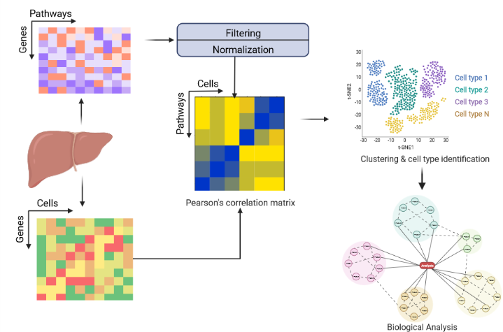
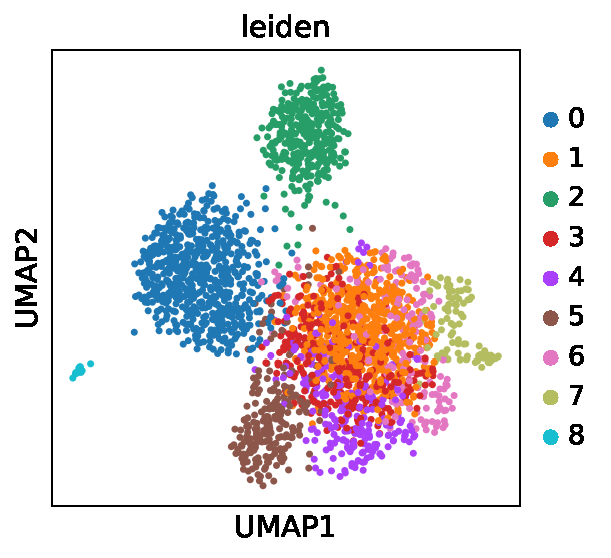

# CSPclust
 Framework to cluster the Cell-specific Signaling Pathways
 
## Installation 
```shell
pip install -r requirements.txt
```


## Load up AnnData object 
~~~ python
import scanpy as sc

adata = sc.read(r"path to h5ad file")
~~~

## Cluster using CSPclust
~~~ python
from CSPclust import *

adata = process(adata)
gene_pathway_matrix, adatacheck, all_pathways, genesyms, found_pathways = getpathways(adata)
adata = compute_clusters(gene_pathway_matrix, adatacheck, all_pathways, genesyms, found_pathways)

~~~

## Visualization
```python
sc.pl.umap(adata, color=['leiden'])
```
